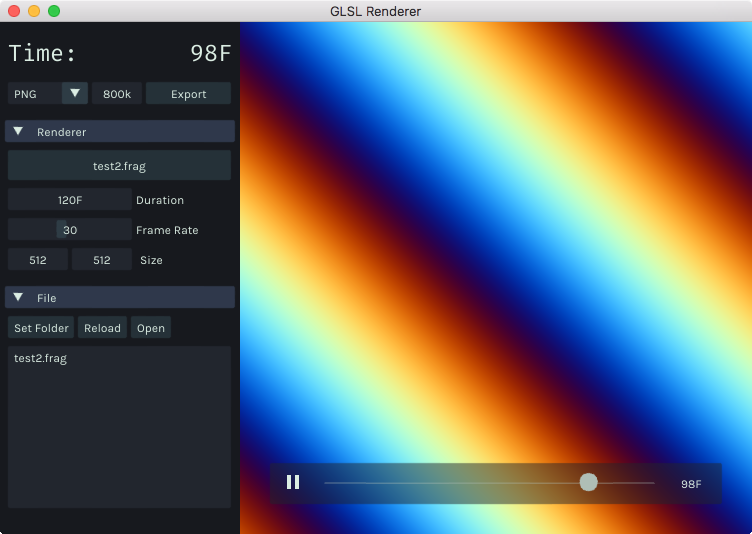

# GLSL Renderer <!--VERSION-->v0.1<!--/VERSION-->



[Download](https://github.com/baku89/GLSLRenderer/releases)

**NOTE: The binary in the release page appears not to work because of FFmpeg dependency. Please re-compile it in your own environment to run.**

## About

GLSL Rendering tool for video production use. The app can export GLSL image using FFmpeg with more detailed composition settings such like duration, size, and fps. This is compiled with [openFrameworks v0.9.8](http://openframeworks.cc/).

Develped by [Baku Hashimoto](http://baku89.com)

### Uniforms

This app passes some uniforms same as Patricio Gonzalez Vivo's [The Book of Shaders Editor](http://editor.thebookofshaders.com/). Please see the [instruction](http://thebookofshaders.com/03/) for more detailed information.

```glsl
uniform vec2 u_resolution; // Canvas size (width,height)
uniform float u_time;     // Time in seconds since load 
```

NOTE: `u_mouse` is not passed.

### Textures

You can pass also textures just like hidden feature of The Book of Shaders Editor.

```glsl
uniform sampler2D textureName; // http://baku89.com/res/baku_grad3.png
```

The textures will be cached automatically. So please hit **[R]** to clear caches if you find textures you changed on remote does not appear to be reflected.

## License

GLSL Renderer is published under a MIT License. See the included [LISENCE file](./LICENSE).

## TODO

* Image Capturing
* "Open in Editor/Finder" option for Windows
* Uniforms control (via ImGui, and OSC)
* [ISF](https://www.interactiveshaderformat.com/) Support (I am also thinking to support ISF as another app)
